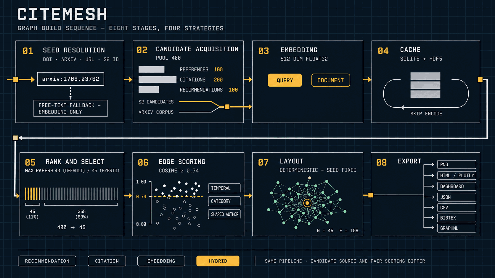

# CiteMesh

CiteMesh turns one paper you already know into a graph of the research around it: the newer papers that follow up on it, and the older foundational work it rests on.

Run it locally with recommendation, citation, embedding, or hybrid discovery, then export an interactive dashboard, graph data, bibliography, or image.


_A hybrid graph seeded by "Megalodon" over a full arXiv corpus index, with "LM-Infinite" selected to expose its semantic relation and shortest path to the seed (45 papers, 108 links)._

After cloning, open the [saved Megalodon dashboard](assets/examples/megalodon/dashboard.html) to explore a graph offline without installing CiteMesh. Its [collection package](assets/examples/megalodon/dashboard.citemesh.json) can be imported through the dashboard's [Add Results control](docs/reference/output-artifacts.md#dashboard-html).

Public beta, pre-1.0: export formats, cache layouts, and defaults may change between revisions. Runs on macOS, Linux, and Windows.

## Quick start

Install PyTorch for your hardware first with the [official selector](https://pytorch.org/get-started/locally/), or pip may resolve a build you did not intend. Then install from GitHub (no PyPI release yet):

```bash
pip install "citemesh[recommended] @ git+https://github.com/pszemraj/CiteMesh.git"
```

Extras: `embeddings` (embedding and hybrid strategies), `viz` (HTML/Plotly exports), `recommended` (both), `all` (adds dev tooling). Omit the extra for the citation/recommendation-only CLI. Editable installs: [Contributing](CONTRIBUTING.md).

Python >= 3.10. For embedding dependencies and device requirements, see [Embedding Runtime](docs/reference/embedding-runtime.md#dependency-floor).

For authenticated Semantic Scholar requests, [configure an API key](docs/guides/configuration.md#api-key). Anonymous access also works, subject to the [retry policy](docs/guides/cli.md#appendix-b-troubleshooting).

### Run one graph

Builds default to Semantic Scholar recommendations. Local embeddings are opt-in with `--strategy embedding` or `--strategy hybrid`; add `--semantic-source arxiv-corpus` to swap the S2 candidates for a downloaded arXiv corpus. Any of these can be saved as personal defaults ([user configuration](docs/guides/configuration.md)).

```bash
# Default: Semantic Scholar recommendations
citemesh build "arxiv:1706.03762"

# Local embeddings over S2 candidates, plus citation links
citemesh build "arxiv:1706.03762" --strategy hybrid --export all

# Embedding search over a downloaded arXiv corpus
citemesh build "arxiv:1706.03762" --strategy embedding --semantic-source arxiv-corpus
```

The first semantic build downloads the [embedding model](docs/reference/embedding-runtime.md#model-selection-and-fallback) and fills its cache. Later runs [reuse the stored vectors](docs/guides/caching.md). Output naming and collection behavior are described in [Output Artifacts](docs/reference/output-artifacts.md#output-location).

## How it works



Follow the pipeline in [How CiteMesh builds a graph](docs/guides/how-it-works.md), choose a [strategy](docs/guides/strategies.md), or browse the [documentation index](docs/README.md).

## Contributing

See [CONTRIBUTING.md](CONTRIBUTING.md). Bug reports and feature requests are welcome via [issues](https://github.com/pszemraj/CiteMesh/issues).

## License

MIT License. See [LICENSE](LICENSE).
