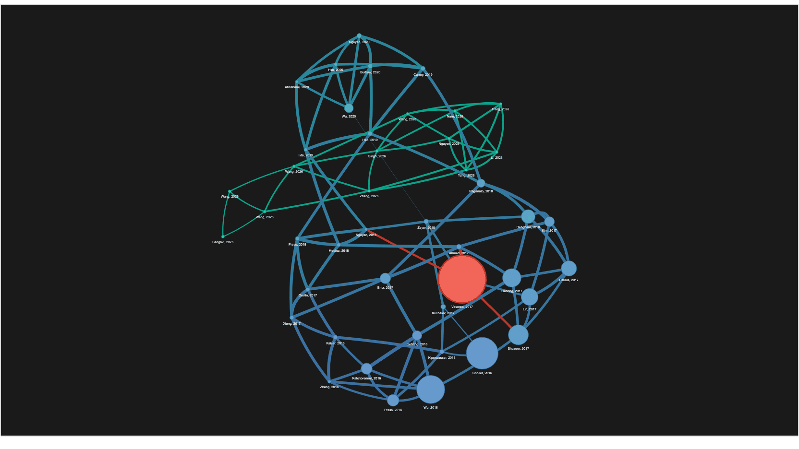
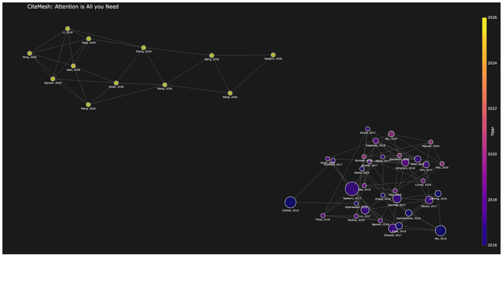
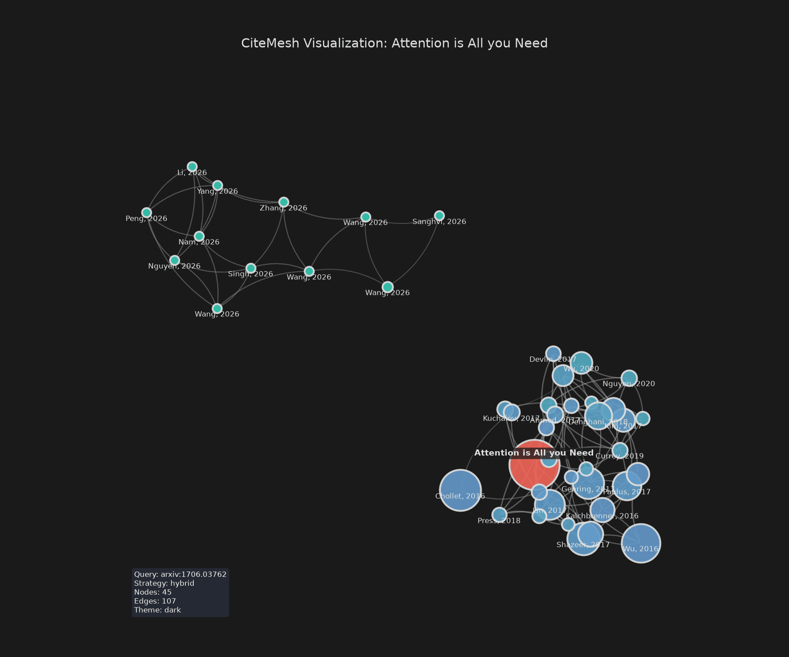
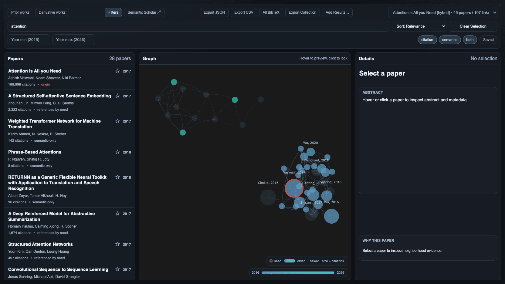

# Output artifacts

File names, path resolution, and the schema of every format CiteMesh writes. Dashboard runs maintain one reusable viewer plus one versioned data package per collection, not a dashboard per seed.

## Artifact set

A dashboard run writes two shared files at the collection root, and sharing a finished collection needs only those two:

- `dashboard.html` - reusable tri-pane viewer with an embedded snapshot, so it opens from the local filesystem
- `dashboard.citemesh.json` - authoritative, portable package holding one or more graph results and their build settings

A hidden `.dashboard.citemesh.json.lock` beside the package serializes collection updates and viewer refreshes, including builds using different `CITEMESH_CACHE_DIR` roots (60-second timeout).

Every collection build also writes a per-seed directory `<title-slug>-<hash>/` holding `<strategy>.json` and `<strategy>.config.json`, even under `--export dashboard` alone. Other formats are written when selected; `png` is the default when `--export` is omitted.

- `<strategy>.png` - static Matplotlib render
- `<strategy>.html` - Pyvis interactive network; self-contained, with vis-network inlined, so it opens offline and needs no sibling asset folder
- `<strategy>.plotly.html` - Plotly interactive graph; self-contained, filling the browser window in the export theme
- `<strategy>.json` - enriched graph payload
- `<strategy>.csv` - flat paper table
- `<strategy>.bib` - combined BibTeX entries
- `<strategy>.graphml` - Gephi/Cytoscape exchange format
- `<strategy>.config.json` - run config + metadata sidecar

The sidecar is always written except for a standalone-only `--export dashboard -o *.dashboard.html` run, and `--export json` never duplicates the graph JSON a dashboard build already wrote. Every artifact goes to a temporary file first and is published by atomic replacement, so a failed writer or post-processing step leaves the existing file in place.

The same hybrid graph through the three non-dashboard renderers:

| Pyvis (`--export html`) | Plotly (`--export plotly`) | Static PNG (`--export png`) |
| --- | --- | --- |
|  |  |  |

_Pyvis settles under browser physics and labels every node; Plotly keeps the Python layout but uses its own year colorbar and labels every node; the PNG adds a run-info box._

## Output location

Omit `--output` to use `out/` under the current working directory; a source checkout tracks `out/.gitkeep` and ignores generated contents. `<title-slug>` is a filesystem-safe paper title, falling back to the canonical seed ID, and `<hash>` is the first 8 characters of `sha256(seed_id)`. Later builds reuse a directory with the same hash suffix, so correcting a title keeps the directory name and lets a refresh replace its exports in place.

- `--output` omitted: non-dashboard artifacts go to `out/<title-slug>-<hash>/<strategy>.<ext>`; a dashboard export writes `out/dashboard.html`, `out/dashboard.citemesh.json`, and `out/<title-slug>-<hash>/<strategy>.json` plus its sidecar.
- An existing `--output` directory wins over suffix rules, even when its name ends in `.json` or `.dashboard.html`: non-dashboard exports go inside it, dashboard exports use it as the collection root.
- `-o out/report.dashboard.html` selects standalone mode: that one self-contained file, no collection package. In a multi-export run it also disables collection mode and gives siblings the stripped base plus their own suffixes (`out/report.json`, `out/report.csv`, `out/report.config.json`).
- Any other `--output` is a directory base, a known export suffix stripped first. Under collection mode the viewer and package sit at that root, every other format under `<base>/<title-slug>-<hash>/`. A single non-dashboard export to a non-directory target keeps a matching suffix, replaces a different known one, and appends a missing one.

The sidecar follows the resolved output: `<strategy>.config.json` beside strategy-named outputs, or the output stem otherwise (`out/report.json` -> `out/report.config.json`). Open the result with [citemesh view](../guides/cli.md#view-a-saved-dashboard).

## Collection package (`dashboard.citemesh.json`)

UTF-8 JSON with `kind: "citemesh-dashboard-collection"`, `schema_version: 1`, `current_result_id`, and `results` ordered most-recently-updated first. Each result holds its stable identity, a seed/title/strategy summary, an `updated_at` timestamp, the graph payload, and portable `build` settings. Machine-local output paths are excluded, so the package moves between machines as one file.

Results are keyed by `(strategy, seed_id)`: a new seed adds a result, the same seed under a different strategy adds a separate one, and the same seed and strategy replaces that slot even when model or build settings changed - collections keep no history of reruns. A refresh also drops optional formats for that strategy that an earlier run produced and this one did not select; other strategies' and unrelated user files are untouched.

Collections in the former `dashboard.manifest.json` layout are migrated on the next build: valid legacy entries are merged in, and the legacy manifest and its artifacts are left in place.

A malformed, unsupported, or inaccessible existing package stops the build before any API call or model work and leaves the file untouched; failed filesystem inspection never counts as a missing package. Per-result files are staged before the collection lock is taken and the package is written last, so an export, rendering, or filesystem failure leaves the previous collection intact and reports the saved package path - short of power-loss atomicity across the bundle.

## Graph JSON (`<strategy>.json`)

The graph payload requires its `seed_id` to identify a node present in the graph. It contains:

- `kind` (`"citemesh-graph"`), `schema_version` (`1`), `seed_id`
- `meta` - `strategy`, `year_range` (`{"min": ..., "max": ...}` over papers with a known year, `null` when none has one), and `candidate_source_status` when the build queried Semantic Scholar sources
- `summary` - `nodes`, `edges`
- `nodes` - enriched per-paper objects
- `dashboard` - render metadata and stored layout geometry, always present
- `edges` - `source`, `target`, `weight`, plus readable `*_title` and `*_label` fields; `source`/`target` are the canonical node IDs, the readable fields are for inspection only

Each node carries:

- core fields `id`, `title`, `year`, `authors`, `abstract`, `citation_count`, `venue`, `arxiv_id`, `doi`, `categories`, `is_seed`, `is_local_corpus`; `year` is `0` when unknown, and those papers drop out of `meta.year_range`
- analysis fields `provenance` (seed/citation/semantic/both), `provenance_base`, `seed_relation` (cites_seed/referenced_by_seed/semantic_only/overlap/seed), `seed_relevance` (personalized PageRank over the final graph - a topology metric computed at export time, not the candidate-selection score used in hybrid reranking)
- `links` (arXiv abs/pdf, DOI, Semantic Scholar URLs) and a deterministic `bibtex` entry

JSON and dashboard share this node schema, and every JSON export carries the layout geometry (`dashboard.meta.plotly_*`), so any `citemesh-graph` file loads back into a dashboard through **Add Results** intact.

## CSV (`<strategy>.csv`)

Columns, one row per paper: `id`, `title`, `year`, `authors` (semicolon-separated), `citation_count`, `venue`, `arxiv_id`, `doi`, `categories` (semicolon-separated), `is_seed`, `provenance`, `seed_relation`, `seed_relevance`, `arxiv_url`, `doi_url`, `semantic_scholar_url`, `abstract`.

An empty graph still writes the header. Both the CLI and dashboard writers quote fields containing commas, quotes, or line breaks, and prefix an apostrophe to text cells beginning with `=`, `+`, `-`, `@`, tab, or carriage return (spreadsheet formula-injection guard), so consumers may see a leading `'`.

## BibTeX (`<strategy>.bib`)

One `@article` per paper, with `title`, `author`, `year`, `doi`, `url`, and `abstract` when available. `doi` and `url` are written verbatim rather than LaTeX-escaped so resolvers receive usable values - `doi` is the raw identifier, `url` the percent-encoded `https://doi.org/...` link - and all other fields are escaped. Citation keys combine a readable paper-ID slug with a stable ID-derived suffix, so IDs differing only in punctuation or case stay distinct. An empty graph produces an empty bibliography.

## GraphML (`<strategy>.graphml`)

A reduced node schema: `provenance`, `provenance_base`, `seed_relation`, `seed_relevance`, `links`, and `bibtex` are omitted, `authors` and `categories` are flattened to comma-separated strings, `is_seed` is written as `0`/`1`, and nullable text fields become empty values. Graph-level attributes are `citemesh_graphml_determinism`, `citemesh_graphml_writer_version`, and one `citemesh_meta_<key>` per run-metadata key.

## Dashboard HTML

`dashboard.html` in collection mode, `<name>.dashboard.html` standalone: a tri-pane interface with an embedded Plotly graph, paper list, and detail panel. Collection-mode HTML embeds a package snapshot because browsers do not reliably let a `file://` page fetch adjacent local files; the package itself stays authoritative.

_**Prior works** active with a paper selected: the graph and paper list narrow to papers the seed references, plus undirected ones published no later than the seed, and the detail pane explains that paper's path to the seed._

Toolbar controls and data actions:

- **CiteMesh / GitHub / Docs / Issues** - open the repository, [documentation](../README.md), or issue tracker in a new tab
- **Prior works / Derivative works** - scope the graph and list by citation direction relative to the seed - papers it references, or papers that cite it - falling back to publication year at or before (or at or after) the seed only for papers the citation graph gives no direction, so the seed, `overlap` papers, and papers without a usable year stay in both
- **List view** - scroll the paper list pane into view; shown only on the stacked layout at 1100px and below, where the list sits under the graph
- **Filters** - text search, sort, year range, provenance chips (citation/semantic/both), `Saved` chip
- **Semantic Scholar ↗** - open the selected paper, or the seed, on Semantic Scholar; disabled when that paper has no Semantic Scholar link
- **Graph selector** - switch between graph slots in the active collection
- **Export JSON / CSV / All BibTeX** - download the embedded payload, a client-side CSV, or every paper's BibTeX
- **Saved BibTeX / Copy Saved Links** - appear once papers are starred: the reading list as `.bib`, or as markdown links
- **Add Results** - import `citemesh-graph` files, packages, or dashboard HTML into the session, refreshing matching `(strategy, seed_id)` slots rather than duplicating them
- **Export Collection** - download the browser session as `dashboard.citemesh.json`, the only way to persist an imported set

_Filters open with `attention` typed: the list narrows from 45 to 28 papers and the graph dims everything else._

Downloads are named from a seed-title slug (`<slug>.json`, `<slug>.csv`, `<slug>.bib`, `<slug>-saved.bib`), falling back to `citemesh` when the title has no ASCII alphanumerics. Starred papers persist in `localStorage` per `(strategy, seed_id)` result, and that list is a superset of the displayed one - entries a later rebuild drops reappear if the paper returns.

Node color is a publication-year gradient shared with the legend and year timeline, node size tracks citation count, the seed wears a ring halo, and edge opacity and width scale with relative link weight. All HTML exports declare `darkreader-lock` and a theme-matched `color-scheme` meta so auto-darkening extensions leave the palettes alone; exports written before that fix landed still repaint under Dark Reader, so rebuild them. The theme is fixed at build time by `--theme` and the dashboard has no toggle; choices are in [CLI Usage](../guides/cli.md), auto-detection inputs in [Environment Variables](environment.md).

## Sidecar (`<strategy>.config.json`)

The run contract for reproducibility and audit trails: `schema_version`, `build`, `outputs` (resolved artifact paths), and `metadata`.

`build` carries strategy-specific sections: `citation` for collection knobs (citation and recommendation record `similarity_threshold` and the shared reference-hydration settings; citation and hybrid also record citation-expansion budgets), `hybrid` for the resolved `max_semantic`, `embedding` for semantic settings including the requested `device`, `model_profile`, and model-revision selector plus `top_k`, the per-node edge cap. Its model and truncate dimension are replaced with the runtime-active checkpoint and effective dimension so the saved settings replay a fallback or profile default. The original revision selector stays in `build` because it is part of the cache namespace; the immutable resolved revision is recorded as metadata. Inactive options are omitted: candidate runs record no corpus-hydration flags, corpus runs no candidate-pool budgets, FP32 storage no INT8 calibration or prefilter settings. `build.refresh_paper_cache` records whether fresh metadata was requested. `build.s2_retry_budget` records the effective recovery-time cap in seconds; `0.0` disables the elapsed cap (see the [API request policy](../guides/cli.md#appendix-b-troubleshooting)).

`metadata` carries:

- run metadata `paper_id`, `seed_id`, `nodes`, `edges`, `theme`, `strategy`
- `score_contract` - `strategy`, `comparable_across_strategies` (always `false`), `range_hint`, `score_type` (`<strategy>_similarity_composite`); hybrid adds an `adjudication_policy` sentence
- `candidate_source_status` - per attempted Semantic Scholar source: `complete` (papers returned), `empty` (response with no papers), or `unavailable` (operational failure). Partial results stay usable and preserve the unavailable source; if every source is unavailable the build fails and writes no artifacts.
- embedding/hybrid runtime metadata when available - runtime-active `effective_model`, immutable `effective_model_revision` and `model_fingerprint`, `effective_truncate_dim`, `effective_device`, `effective_compute_dtype`, resolved `model_profile`, and `retrieval_representation` / `graph_representation` (terms defined in [Embedding Runtime](embedding-runtime.md))

## Graph input

When a node carries a `Paper` under its `paper` attribute, exports, PNG rendering, and artifact filenames use that record for bibliographic metadata, including empty values that clear stale mirrored fields. A node-level `is_seed` overrides `Paper.is_seed`; nodes without a `Paper` use their scalar attributes.

Node IDs must be non-empty, have no surrounding whitespace, and remain unique after conversion to strings. Enriched citation counts use the shared non-negative integer normalizer: booleans, nulls, nonnumeric text, and NaN become zero. Integral numeric years (including `2017.0`) are accepted; fractional or non-finite years are missing. Null or non-finite edge weights raise before exports replace existing files.

## Determinism notes

- `json` - deterministic key order and indentation; `csv` and `bibtex` follow JSON node order.
- `graphml` - deterministic ordering on supported NetworkX versions.
- `png` - deterministic for the same input graph and `--seed`; `plotly` likewise when it supports `write_html(div_id=...)`.
- `html` (Pyvis) - deterministic serialized structure, but browser physics are runtime-driven.
