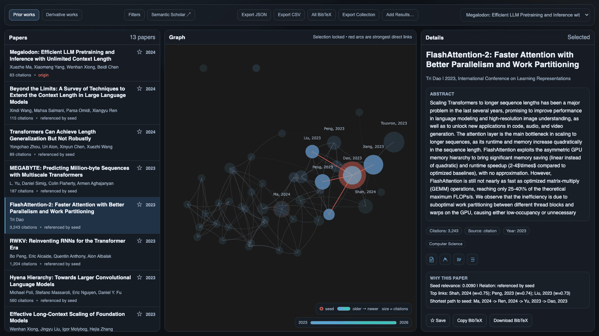

# Output Artifacts

CiteMesh writes graph outputs by format. Dashboard collections use one reusable
viewer plus one versioned data package instead of generating a dashboard for every
seed.

Related docs:

- CLI flags and output-path behavior: [CLI Usage](../guides/cli.md)
- Strategy behavior and score semantics: [Strategy Guide](../guides/strategies.md)
- Embedding runtime metadata terms: [Embedding Runtime](embedding-runtime.md)

## Artifact Set

A normal dashboard run writes two shared files at the collection root:

- `dashboard.html` - reusable tri-pane viewer with an embedded snapshot, so it opens directly from the local filesystem
- `dashboard.citemesh.json` - authoritative, portable collection package containing one or more graph results and their portable build settings

Every collection build also saves its own graph and build settings under the
seed's `<slug>-<hash>/` directory, even with only `--export dashboard`:

- `<strategy>.json` - complete standalone graph payload, including titles, IDs,
  papers, edges, and dashboard layout; readable independently and loadable through
  **Add Results**
- `<strategy>.config.json` - build settings, output paths, and runtime metadata

Reusing the same collection root adds or refreshes a package result and writes
the current seed's files without rewriting other seeds' files. Results are keyed
by `(strategy, seed_id)`, so rebuilding the same seed with the same strategy
updates that slot while a different strategy remains a separate result.

The filenames identify the collection; seed titles and IDs live inside it.
The dashboard's **Graph selector** labels results by title and strategy. On each build:

- A different seed adds a result and retains existing results.
- The same seed with a different strategy adds a separate result.
- The same seed and strategy replaces that result, even if model or build
  settings changed. Collections do not retain a history of those reruns.

Other formats are written when selected (`png` remains the default when no export
format is supplied):

- `<strategy>.png` (static Matplotlib render)
- `<strategy>.html` (Pyvis interactive network)
- `<strategy>.plotly.html` (Plotly interactive graph)
- `<strategy>.json` (enriched graph data payload)
- `<strategy>.csv` (flat paper table for pandas/spreadsheets)
- `<strategy>.bib` (combined BibTeX entries for all papers)
- `<strategy>.graphml` (exchange format for Gephi/Cytoscape)
- `<strategy>.config.json` (run config + metadata sidecar for non-dashboard artifacts)

When dashboard is combined with other formats, those additional artifacts live
alongside the graph JSON and its sidecar under `<slug>-<hash>/`. Explicitly adding
`--export json` does not duplicate the JSON file. `--export all` adds the remaining
formats in the same directory.

## Output Location

For repository-local runs, omit `--output` to use `out/`. This directory has a
tracked `.gitkeep`, and generated contents are ignored by Git. An explicit
`--output` overrides that location; a root-level name such as `research` creates
a separate directory outside the ignored output tree.

Dashboard exports use two shared collection files directly under `out/` and keep
the graph JSON and build sidecar under `out/<slug>-<hash>/`. A first dashboard
build therefore produces:

```text
out/
  dashboard.html
  dashboard.citemesh.json
  <slug>-<hash>/
    hybrid.json
    hybrid.config.json
```

The collection package remains a portable copy of all results. The per-seed JSON
files let you inspect, copy, or import a single graph without extracting it from
that package.

Path components:

- `<slug>` is a filesystem-safe version of the seed title
- `<hash>` is the first 8 chars of `sha256(seed_id)`

Canonical path-normalization rules:

- `--output` omitted:
  - non-dashboard artifacts are written under `out/<slug>-<hash>/` as `<strategy>.<ext>`
  - a normal dashboard export writes `out/dashboard.html`, `out/dashboard.citemesh.json`, and `out/<slug>-<hash>/<strategy>.json` plus its config sidecar
- single-export run (`--export <one-format>`) with explicit `--output`:
  - `--export dashboard -o out/my-collection` puts the shared viewer/package in `out/my-collection/` and the graph JSON/sidecar in `out/my-collection/<slug>-<hash>/`
  - `--export dashboard -o out/report.dashboard.html` requests standalone mode and writes exactly that one self-contained file; it does not create or update a collection package
  - for non-dashboard formats, a matching target suffix is used as-is, a different known export suffix is replaced, and a missing suffix is appended
- multi-export run (`--export all` or multiple formats) with explicit `--output`:
  - if `dashboard` is among the selected formats and `--output` ends with `.dashboard.html`, the dashboard stays a standalone file at that exact path, collection mode is disabled, and sibling exports use the stripped base with their own suffixes (for example `out/report.json`, `out/report.csv`, `out/report.config.json`)
  - if `--output` ends with a known export suffix (for example `out.png`), that suffix is stripped and the remainder is treated as directory base
  - if `--output` has no known suffix, it is treated directly as directory base
  - with dashboard collection mode, the viewer/package stay at the directory root; graph JSON, its sidecar, and every additional format are written under `<directory-base>/<slug>-<hash>/`
  - without dashboard collection mode, each format follows the normal single/multi-export resolver

Examples:

- `citemesh build "<paper-id>" --strategy hybrid --export dashboard` writes the shared viewer/package in `out/` plus `out/<slug>-<hash>/hybrid.json` and `hybrid.config.json`
- adding `-o out/my-collection` uses that directory as the root for the same structure
- running again for another paper adds its directory and a second result to the same package, then refreshes the shared viewer
- `citemesh build "<paper-id>" --strategy hybrid --export all -o out.png` writes `out/dashboard.html`, `out/dashboard.citemesh.json`, `out/<slug>-<hash>/hybrid.png`, `out/<slug>-<hash>/hybrid.html`, `out/<slug>-<hash>/hybrid.plotly.html`, `out/<slug>-<hash>/hybrid.json`, `out/<slug>-<hash>/hybrid.csv`, `out/<slug>-<hash>/hybrid.bib`, `out/<slug>-<hash>/hybrid.graphml`, and `out/<slug>-<hash>/hybrid.config.json`
- `citemesh build "<paper-id>" --strategy citation --export json -o out/report.graphml` writes `out/report.json`
- `citemesh build "<paper-id>" --strategy recommendation --export dashboard -o out/report.dashboard.html` writes the standalone dashboard file `out/report.dashboard.html`
- `citemesh build "<paper-id>" --strategy recommendation --export dashboard --export json -o out/report.dashboard.html` writes `out/report.dashboard.html`, `out/report.json`, and `out/report.config.json`

### Collection Package (`dashboard.citemesh.json`)

The package is ordinary UTF-8 JSON with:

- `kind: "citemesh-dashboard-collection"`
- `schema_version: 1`
- `current_result_id`
- `results`, ordered with the most recently added or refreshed result first

Each result contains its stable result identity, seed/title/strategy summary,
canonical graph payload, and the portable `build` settings needed to understand or
reproduce the run. Machine-local output paths are excluded from the embedded build
settings, so the package can be moved between directories and machines as one file.
Each embedded graph uses `kind: "citemesh-graph"` and `schema_version: 1`.

Collections created by the former `dashboard.manifest.json` layout are migrated on
the next collection build. CiteMesh reads valid legacy entries and merges them into
`dashboard.citemesh.json`; migration does not rewrite or delete the legacy manifest
or its referenced artifacts.

An existing malformed, unsupported, or inaccessible package stops the build before
CiteMesh makes API calls or starts model work, and the file is left untouched.
Failed filesystem inspection never counts as a missing package. Package persistence
precedes viewer refresh so an unexpected HTML-rendering failure cannot discard a
completed graph: the error reports the saved package path, which can be loaded from
another current dashboard with **Add Results**, or the command can be rerun after the
renderer is repaired.

## JSON vs Sidecar

`<strategy>.json` and `<strategy>.config.json` serve different purposes:

- `<strategy>.json`: graph payload (`nodes`, `edges`, basic summary) for downstream graph/data work.
- `<strategy>.config.json`: run contract (CLI parameters, resolved outputs, and metadata) for reproducibility and audit trails.

Sidecar path contract:

- for strategy-named outputs, sidecar is `<strategy>.config.json` in the same directory
- for explicit single-file outputs, sidecar uses the resolved output stem (for example `out/report.json` -> `out/report.config.json`)

### Graph JSON (`<strategy>.json`)

Top-level fields:

- `kind` (`"citemesh-graph"`)
- `schema_version` (`1`)
- `seed_id`
- `meta` (`strategy`, `year_range`, and `candidate_source_status` when the build queried Semantic Scholar neighborhood sources). `year_range` is `{"min": ..., "max": ...}` over the papers with a known publication year, and `null` when no paper has one.
- `summary` (`nodes`, `edges`)
- `nodes` - enriched per-paper objects (see below)
- `dashboard` (`meta` and the stored layout geometry are always present)
- `edges` (`source`, `target`, `weight`, plus readable source/target title/label fields)

`source`/`target` are canonical node IDs for unambiguous graph processing. The extra `*_title` and `*_label` fields are provided for readable inspection.

Each node includes:

- core fields: `id`, `title`, `year`, `authors`, `abstract`, `citation_count`, `venue`, `arxiv_id`, `doi`, `categories`, `is_seed`
- analysis fields: `provenance` (seed/citation/semantic/both), `provenance_base`, `seed_relation` (cites_seed/referenced_by_seed/semantic_only/overlap/seed), `seed_relevance` (personalized PageRank score)
- external: `links` (arXiv abs/pdf URLs, DOI URL, Semantic Scholar URL)
- `bibtex` (deterministic BibTeX entry)

The JSON and dashboard formats share the same enriched node schema. Every JSON export carries the stored dashboard render metadata and layout geometry (`dashboard.meta.plotly_*`), so any `citemesh-graph` file can be loaded back into the dashboard via **Add Results** without losing graph geometry - including files produced by a data-only `--export json` run.

### CSV (`<strategy>.csv`)

Flat table with one row per paper. Columns: `id`, `title`, `year`, `authors` (semicolon-separated), `citation_count`, `venue`, `arxiv_id`, `doi`, `categories` (semicolon-separated), `is_seed`, `provenance`, `seed_relation`, `seed_relevance`, `arxiv_url`, `doi_url`, `semantic_scholar_url`, `abstract`.

An empty graph still writes the column header. Both CLI and dashboard exports
quote fields containing commas, quotes, newlines, or carriage returns.

### BibTeX (`<strategy>.bib`)

Combined BibTeX entries for all papers in the graph, one `@article` per paper. Ready for direct import into reference managers or LaTeX projects.

Citation keys combine a readable paper-ID slug with a stable ID-derived suffix,
so IDs differing only in punctuation or letter case retain distinct keys.
An empty graph produces an empty bibliography.

### Dashboard HTML

The dashboard viewer (`dashboard.html` in collection mode, or `<name>.dashboard.html` for explicit standalone output) is a tri-pane research interface with embedded Plotly graph, paper list, and detail panel. Collection-mode HTML embeds a snapshot of `dashboard.citemesh.json`; this intentional duplication lets the viewer work when opened as `file://...`, where browsers do not reliably permit JavaScript to fetch adjacent local files. The JSON package remains the authoritative reusable data file.



_The same local run with **Prior works** active: the graph and paper list narrow
to 19 foundational papers while the selected seed's full details remain visible._

**Toolbar data actions:**

- **Export JSON** - downloads the embedded enriched payload as a standalone `.json` file
- **Export CSV** - generates a CSV table client-side from the current dataset
- **All BibTeX** - downloads all papers' BibTeX entries as a single `.bib` file
- **Saved BibTeX / Copy Saved Links** - appear once you star papers; download the reading list as `.bib`, or copy it as a markdown link list
- **Graph selector** - switches between graph slots in the active collection
- **Add Results** - imports one or multiple `citemesh-graph` JSON files, `citemesh-dashboard-collection` packages, or current dashboard HTML exports into the browser session; matching `(strategy, seed_id)` slots are refreshed instead of duplicated
- **Export Collection** - downloads the active one-or-many-result browser collection as `dashboard.citemesh.json`

In collection mode, keep one `dashboard.html` open and move between results rather
than opening a separate dashboard for each paper. Browser imports change the
in-memory session; use **Export Collection** to persist that merged set.

**Reading list:** every paper row and the detail panel carry a star toggle. Starred
papers persist in browser `localStorage` per `(strategy, seed_id)` result, the
`Saved` chip filters the list down to them, and the saved-scoped export buttons
above turn a triage session into a `.bib` file or a markdown link list without
opening each paper in a tab.

**Visual encodings:** node color is a publication-year gradient (the on-graph legend and year timeline share the exact colorscale), node size tracks citation count, the seed wears a ring halo, and edge opacity/width scale with relative link weight within the graph. Hovering a node shows a theme-styled card (wrapped title, authors, year | citations | venue, and its relation to the seed) and previews the full details panel; clicking locks the selection and draws its strongest links as arcs.

All HTML exports declare `darkreader-lock` and a theme-matched `color-scheme` meta
so auto-darkening browser extensions leave the tuned palettes alone. Theme choices
and defaults are described in [CLI Usage](../guides/cli.md); auto-detection inputs
are described in [Environment Variables](environment.md).

### Sidecar (`<strategy>.config.json`)

Top-level fields:

- `schema_version`
- `build` (resolved build parameters)
- `outputs` (resolved artifact paths)
- `metadata` (run metadata captured during graph build/export)

`build` includes strategy-specific sections:

- `citation` for reference/citation collection knobs that affected the run. Recommendation sidecars include only shared reference-hydration settings, while citation and hybrid sidecars also include citation-expansion budgets.
- `hybrid` for resolved `max_semantic`.
- `embedding` for embedding/hybrid semantic settings, including the requested `device` and `model_profile` tokens.

Inactive source and storage options are omitted: candidate runs do not record
corpus-hydration flags, corpus runs do not record candidate-pool budgets, and
FP32 storage does not record INT8 calibration or prefilter settings.
`build.refresh_paper_cache` records whether fresh paper metadata was requested.

Exports accept integral numeric years (including values such as `2017.0`);
fractional or non-finite years are treated as missing. GraphML writes nullable
text fields as empty values. Null or non-finite edge weights raise a clear error
before exports replace existing files. GraphExporter rejects empty node IDs and
IDs with surrounding whitespace, matching the dashboard's import contract.
Plotly marker labels display upstream markup as literal text. Static PNG exports
use an `Unknown` title when the requested seed is absent, including empty graphs.

`metadata` includes:

- common run metadata (`paper_id`, `seed_id`, `nodes`, `edges`, `theme`, `strategy`)
- strategy score semantics (`score_contract`)
- Semantic Scholar neighborhood outcomes (`candidate_source_status`) keyed by
  attempted source. Values are `complete` (papers returned), `empty` (successful
  response with no papers), or `unavailable` (operational failure). Partial
  results remain usable and preserve the unavailable source; if every attempted
  source is unavailable, the build fails and writes no normal result artifacts.
- embedding/hybrid runtime metadata when available, including `effective_device`, `effective_compute_dtype`, and the resolved `model_profile`, plus `retrieval_representation` and `graph_representation` identifying the distinct prompt-conditioned vector roles

See embedding metadata term definitions in [Embedding Runtime](embedding-runtime.md).

## Determinism Notes

- `json`: deterministic key order + indentation.
- `csv`: deterministic column order and row order (same as JSON node order).
- `bibtex`: deterministic entry order (same as JSON node order).
- `graphml`: deterministic ordering on supported NetworkX versions.
- `png`: deterministic for same input graph and `--seed`.
- `plotly`: deterministic for same input graph and `--seed` when Plotly supports `write_html(div_id=...)`.
- `html` (Pyvis): deterministic serialized structure, but browser physics are runtime-driven.
